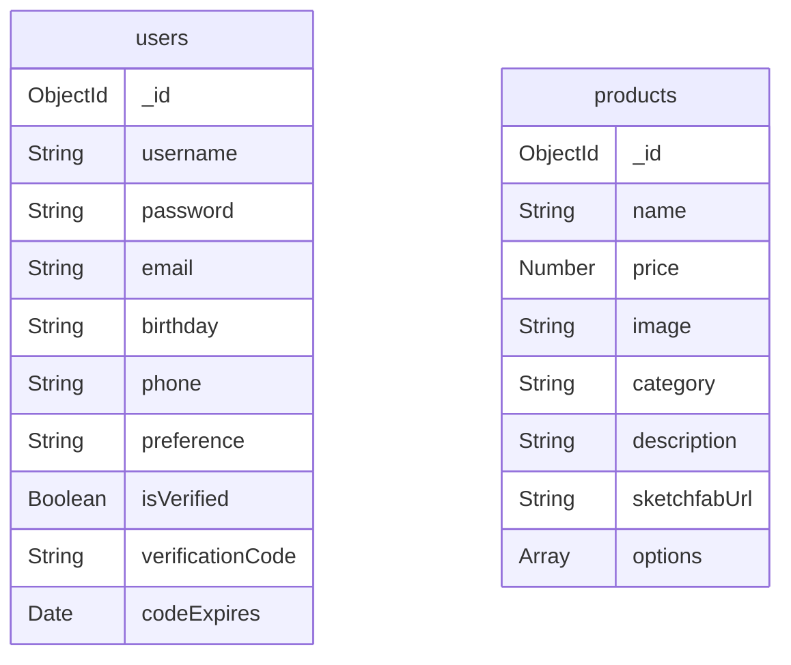

# 資料庫排版

本專案目前使用 MongoDB + Mongoose。後端預設連線字串如下：

```env
MONGODB_URI=mongodb://db:27017/retro_shop
```

資料庫名稱：`retro_shop`

目前主要 collections：

| Collection | Mongoose Model | 用途 |
| --- | --- | --- |
| `users` | `User` | 會員帳號、登入密碼、Email 驗證狀態、個人資料 |
| `products` | `Product` | 商品資料、價格、分類、圖片、3D 模型連結、口味選項 |

## users

來源：`backend/server.js` 的 `userSchema`

| 欄位 | 型別 | 必填 | 預設值 | 說明 |
| --- | --- | --- | --- | --- |
| `_id` | ObjectId | 自動產生 | - | MongoDB 文件 ID |
| `username` | String | 是 | - | 會員帳號，Mongoose schema 設定 `unique: true`，並會 `trim` |
| `password` | String | 是 | - | bcrypt hash 後的密碼，不存明碼 |
| `email` | String | 是 | - | 會員 Email，目前註冊流程會檢查是否重複 |
| `birthday` | String | 否 | `""` | 會員生日，前端用 `input type="date"` 儲存成字串 |
| `phone` | String | 否 | `""` | 會員電話 |
| `preference` | String | 否 | `""` | 網站傾向/偏好分類，例如糖果、餅乾、飲料 |
| `isVerified` | Boolean | 否 | `false` | Email 驗證是否完成 |
| `verificationCode` | String | 否 | - | 註冊驗證碼，驗證完成後會清空 |
| `codeExpires` | Date | 否 | - | 驗證碼過期時間，目前註冊後 5 分鐘過期 |
| `__v` | Number | 自動產生 | - | Mongoose 版本欄位 |

範例：

```json
{
  "_id": "66...",
  "username": "testuser",
  "password": "$2b$10$...",
  "email": "test@example.com",
  "birthday": "2000-01-01",
  "phone": "0912345678",
  "preference": "糖果",
  "isVerified": true
}
```

注意事項：

- `password` 只存 bcrypt hash，不應回傳給前端。
- JWT token 不存在資料庫中；登入成功後由後端簽發，前端暫存在 `localStorage.authToken`。
- `email` 目前是由程式註冊流程檢查重複，schema 尚未設定 `unique: true`。如果之後正式上線，建議也加上資料庫唯一索引。
- `verificationCode` 和 `codeExpires` 驗證成功後會被設成 `undefined`。

## products

來源：`backend/server.js` 的 `productSchema`

| 欄位 | 型別 | 必填 | 預設值 | 說明 |
| --- | --- | --- | --- | --- |
| `_id` | ObjectId | 自動產生 | - | MongoDB 文件 ID |
| `name` | String | 是 | - | 商品名稱 |
| `price` | Number | 是 | - | 商品價格 |
| `image` | String | 是 | - | 商品圖片路徑，例如 `images/ramune.jpg` |
| `category` | String | 是 | - | 商品分類，例如 `drink`、`candy` |
| `description` | String | 否 | - | 商品描述 |
| `sketchfabUrl` | String | 否 | - | 單一商品的 3D 模型連結 |
| `options` | Array<Object> | 否 | `[]` | 商品口味/版本選項 |
| `__v` | Number | 自動產生 | - | Mongoose 版本欄位 |

### products.options

`options` 是嵌入在商品文件裡的子陣列，不是獨立 collection。

| 欄位 | 型別 | 必填 | 說明 |
| --- | --- | --- | --- |
| `_id` | ObjectId | 自動產生 | Mongoose 會替每個 option 子文件產生 ID |
| `flavor` | String | 否 | 口味名稱，例如草莓、紅茶 |
| `sketchfabUrl` | String | 否 | 該口味專屬的 3D 模型連結 |

範例：

```json
{
  "_id": "66...",
  "name": "飛壘口香糖",
  "price": 10,
  "image": "images/feilei.jpg",
  "category": "candy",
  "description": "可以吹出超大泡泡的經典口香糖",
  "options": [
    {
      "flavor": "草莓",
      "sketchfabUrl": "https://sketchfab.com/3d-models/..."
    },
    {
      "flavor": "橘子",
      "sketchfabUrl": "https://sketchfab.com/3d-models/..."
    }
  ]
}
```

## 目前資料關係



目前 `users` 和 `products` 沒有資料庫層級的關聯。購物車目前仍存在前端 `localStorage`，所以資料庫中還沒有 `carts` 或 `orders` collection。

## 自動匯入商品資料

後端啟動並連上 MongoDB 後，會檢查：

```js
const count = await Product.countDocuments();
```

如果 `products` collection 是空的，就會把 `initialProducts` 匯入資料庫。

這代表：

- 第一次啟動資料庫時會自動建立初始商品。
- 如果資料庫裡已經有商品，就不會重複匯入。
- 修改 `initialProducts` 不會自動更新既有資料庫內容，除非手動清空或寫 migration。

## 未來可新增的資料表

之後如果要把購物車和訂單搬到後端，可以考慮新增：

| Collection | 用途 |
| --- | --- |
| `carts` | 儲存每個會員尚未結帳的購物車內容 |
| `orders` | 儲存結帳後的訂單紀錄 |

建議先新增 `orders`，讓結帳後至少有真正訂單紀錄；購物車可以晚一點再從 `localStorage` 搬到資料庫。
